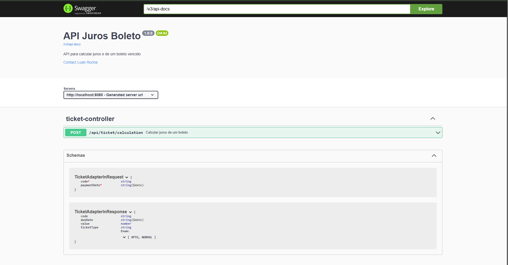

# API Calcula Juros de Boleto

Uma API RESTful que calcula juros de boletos vencidos, seguindo a Arquitetura Hexagonal.  
A documentação interativa está disponível via Swagger (ver seção **Documentação Swagger** abaixo).

## Visão Geral

Este projeto expõe um endpoint que:
1. Recebe código de boleto e data de pagamento.
2. Valida se o boleto é do tipo **XPTO** e se está vencido.
3. Consulta uma API externa para obter dados adicionais do boleto (data de vencimento, valor original, tipo, etc.).
4. Calcula juros proporcionais ao atraso (1% ao mês → 0,033% ao dia).
5. Persiste no banco de dados todas as solicitações e resultados de cálculo.
6. Retorna ao cliente um JSON com os dados do boleto e o valor final (valor original + juros).

## Documentação Swagger

  
**Acesse no navegador:**  
`http://localhost:8080/swagger-ui/index.html`

---

## Diagrama de Arquitetura Hexagonal

  
Este diagrama ilustra como a Arquitetura Hexagonal (Ports & Adapters) está implementada neste projeto.

## Problema e Requisitos

### Descrição do Problema

> **Enquanto** usuário da API,  
> **quero** digitar um código de boleto vencido,  
> **e** receber o valor atualizado com juros.

### Requisitos Funcionais

Request →
```json
{
  "codigo": "string",
  "data_pagamento": "YYY-MM-DD HH:MM:SS"
}
```

Response →
```json
{
  "codigo": "string",
  "data_vencimento": "YYYY-MM-DD",
  "valor": 00.0,
  "tipo": "XPTO|NORMAL"
}
```
<br>
<br>
<br>

# Ferramentas

- Spring Tool Suite 4
- Spring boot
- Docker
- Docker-compose
- Swagger
- Spring JPA
- PostgreSql
- Feign Client
